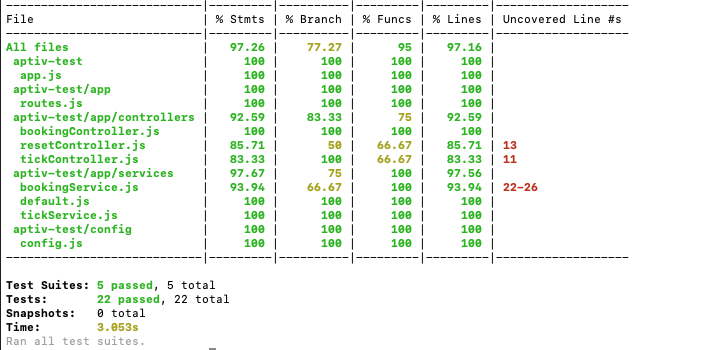
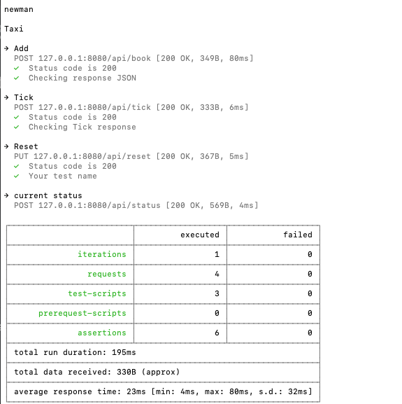
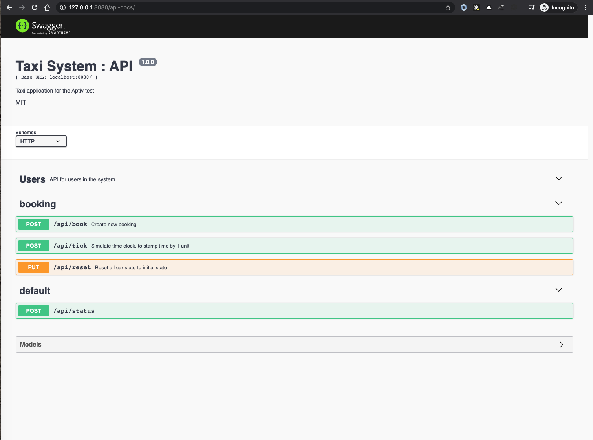

# APTIV : Taxi booking system

The following is the repository of the Aptiv - Taxi booking take home assignment.
The problem statement is defined with the following file as follows.
Read more [here](./README2.md)


># 1. Getting Started

- Clone this repository into the machine you want to run this application
- Install the dependencies using NPM
- Run the application using docker / using npm run start

### 1.1 Installing

Follow the steps as below to get the application up and running

- Clone the appliation using the URL, and then cd into the directory
```
$ cd $DIR
```
- Install the dependencies using the following command
```
$ npm install
```
- Use the following command to start the application
```
$ npm run start
```


To test if the application is up and running, run the following command in another terminal tab to get
the following output.
```
$ curl --location --request POST '127.0.0.1:8080/api/status'
```
Response for the previous CURL command
```
{
"result":{
        "timeUp":0,
        "initialPosition":[0,0],
        "cars":3,
        "carsData":[
                    {"id":1,"x":0,"y":0,"available":true,"timeRemaining":0},
                    {"id":2,"x":0,"y":0,"available":true,"timeRemaining":0},
                    {"id":3,"x":0,"y":0,"available":true,"timeRemaining":0}],
        "time":0
    }
}
```
### 1.2 Installing with Docker
```
See Section `3.2 Building with docker` below.
```
#
># 2. Tests in the system

The following tests are included in the system
- Unit testing : Jest
- Testing code coverage : Jest-coverage
- API contract testing : Newman
- Lint tests : eslint

### 2.1 - Unit testing:
- Jest is used as the unit testing framework
- All the files types :
    1. Controllers
    2. Services
    3. Helper
    files are unit tested to give cover all the methods and edge cases.

To run the same, use the following command
```
$ npm run test
```
Sample output :
```
Test Suites: 5 passed, 5 total
Tests:       22 passed, 22 total
Snapshots:   0 total
Time:        3.052s
Ran all test suites.
```
### 2.2 - Testing code coverage
- We use the `collectCoverage` option of Jest to invoke the test coverage in the project

The get test coverage, run the following command
```
$ npm run test:cover
```

sample output of the above command is as follows




### 2.3 - API contract testing
- We use newman with the postman collection JSON to test the API contract testing
- This helps in verifying if there are any changes in the API usage or calling , helping us to
identify how the APIs are called by other services.

The get test coverage, run the following command
```
$ npm run test:contract
```
The sample output of the above command is as follows



### 2.4 - Lint tests:
- `eslint` is the tool for identifying and reporting on patterns found in ECMAScript/JavaScript code.

The following lint commands are available in the system
```
$ npm run lint:check                // Checks the system for lint issues
$ npm run lint:fix                  // Fixes the lint issues
```


## 2.5 - PreHook Tests
- Currently `eslint` test runs before any commit.
- This helps in clearing out any formatting errors and enforces code quality
```
$ npm run pretest                   // is being run before a commit
```
#


># 3. CI / CD Strategies
### 3.1 - Jenkinsfile
- The project has a sample jenkins configuration file which could include the following actions:
    1. Obtaining the latest code from the source control
    2. Pushing packages to artifactory
    3. Running the test cases on the application
    4. Running integration tests on the application
    5. Checking for quality, vulnerabilities with SonarQube
    6. Building the docker image to push to image repository
    7. Pushing the docker image to Open shift or any server

### 3.2 - Building with Docker
- The project is bootstrapped to run as a docker container.
- The following command starts the container and the app is available at `http://127.0.0.1:8080`
```
$ docker-compose up -d
```

- The docker container spins up the swagger UI in the following url `http://127.0.0.1:8080/api-docs`.
- The swagger UI also presents another alternative to test the application.
 The screenshot attached.



># 4. Logging
### Winston
- `winston` is added to the project

The sample log has been implemented in `bookingService.js`
```
 info: {"car_id":1,"total_time":3} {"meta":{"service":"booking-service"},"service":"taxi-service"}
```


># 5. Enhancements:
### Automatic Swagger Generator
- This will help in uniform development of the APIs

### Global error handler
- This will help in bubbling any error in the application to be handled by a common method
- This makes centralized logging of errors and tracing of the error flow easier

### Sentry integration
- Building up on the global error handler, Integration to services like Sentry will give us real time metrics on errors and other events happening in the application

### More hooks
- Adding more hooks with git will help enhance quality of code
- It also helps in catching errors / inconsistencies early in the development cycle

### Global error constants
- Global error constants help in uniformity of code
- It also helps in debugging issues faster


## Built With

* [Express JS](https://expressjs.com/) - The web framework used
* [NPM](https://www.npmjs.com/) - Dependency Management
* [Jest](https://jestjs.io/) - Unit testing Framework
* [Postman](https://www.postman.com/) - API Testing


## Authors
* **Thayub J**  - [Github](https://github.com/thayub)

## License
This project is licensed under the MIT License.
